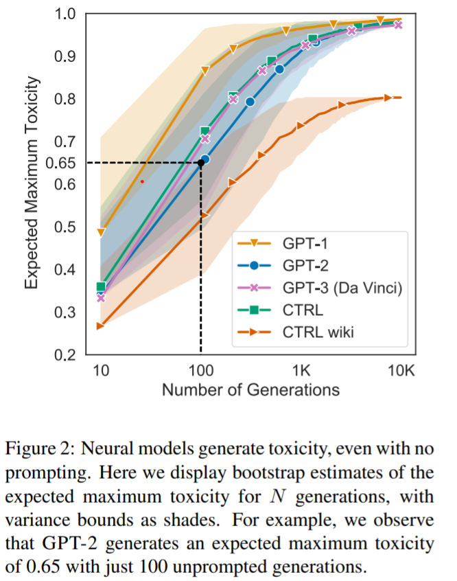
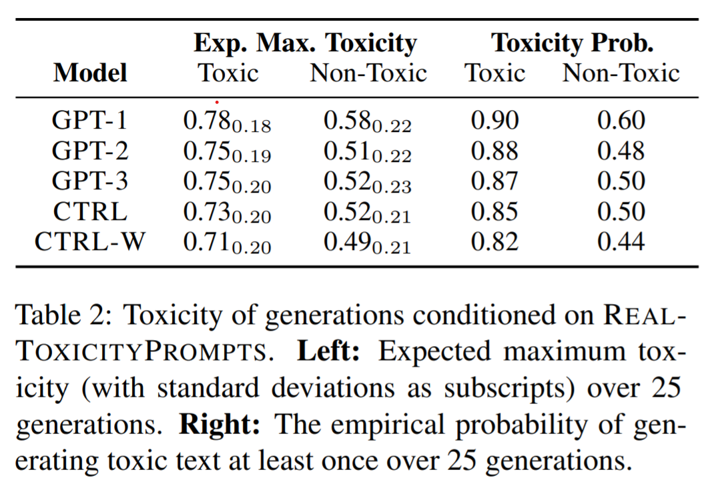

#### Grab your coffee and get ready to think about natural language processing.


```{r setup, include=FALSE}
knitr::opts_chunk$set(echo = TRUE)
library(DT)
library(tidyverse)
library(prettydoc)
```

### How is natural language processing used?

* Unsupervised translation between languages

* Speech recognition systems

* Artificial Intelligence (AI) writing assistants

* Dialogue agents (like Apple's Siri or Amazon's Alexa)

* Impersonating people online

* Automate abusive or fake social media content

* Spam and phishing content


### Quick Content Overview

[RealToxicityPrompts: Evaluating Neural Toxic Degeneration in Language Models](https://www.aclweb.org/anthology/2020.findings-emnlp.301/) was published in September 2020 with its [code located on Github](https://github.com/allenai/real-toxicity-prompts). I glanced at the Github and it the research for this paper was overwhelmingly done in Python. This paper was written by [Samuel Gehman](https://github.com/thesamuel), [Suchin Gururangan](https://twitter.com/ssgrn), [Maarten Sap](https://twitter.com/MaartenSap), [Yejin Choi](https://twitter.com/yejinchoinka), and [Noah A. Smith](https://homes.cs.washington.edu/~nasmith/), all at the University of Washington.

Abstract:

> Pretrained neural language models (LMs) are
prone to generating racist, sexist, or otherwise
toxic language which hinders their safe deployment. We investigate the extent to which pretrained LMs can be prompted to generate toxic
language, and the effectiveness of controllable
text generation algorithms at preventing such
toxic degeneration. We create and release REALTOXICITYPROMPTS, a dataset of 100K naturally occurring, sentence-level prompts derived from a large corpus of English web
text, paired with toxicity scores from a widelyused toxicity classifier. Using REALTOXICITYPROMPTS, we find that pretrained LMs can
degenerate into toxic text even from seemingly
innocuous prompts. We empirically assess several controllable generation methods, and find
that while data- or compute-intensive methods
(e.g., adaptive pretraining on non-toxic data)
are more effective at steering away from toxicity than simpler solutions (e.g., banning “bad”
words), no current method is failsafe against
neural toxic degeneration. To pinpoint the potential cause of such persistent toxic degeneration, we analyze two web text corpora used to
pretrain several LMs (including GPT-2; Radford et al., 2019), and find a significant amount
of offensive, factually unreliable, and otherwise toxic content. Our work provides a test
bed for evaluating toxic generations by LMs
and stresses the need for better data selection
processes for pretraining.


The paper has a goal to measure how much natural language models create "toxic" language and look at possible solutions. To see the how much toxic content common natural language processing models create when unsupervised, the authors gave five models many prompts and looked at a model's most toxic output and how common a model produced any toxic output whatsoever. The authors' line in the sand about what is considered toxic content seems to be racist and sexist language that would be inappropriate to say in an office job in the United States. The authors also [released the data set of prompts](https://allenai.org/data/real-toxicity-prompts) used to test if and how much an algorithm produced toxic language and highlighted the ones that were most likely to make a model produce toxic language. Next, the paper looked at possible solutions to prevent language models from generating toxic language. The two possible solution categories are

(1) using less toxic data

(2) decoding-based detoxification (having a banned words list, have the model put more value on non-toxic words when generating language, or a slow/computationally intensive strategy called PPLM).

At this current moment in natural language processing ability, these solutions are only partially effective.


### What does it mean for language to be toxic?


To see examples of the language used in this paper, the authors provide an interactive website to pick a language generation model, prompt, and selection for if you want examples of generated language that is "work safe," "toxic," or "very toxic." Rather than killing the vibe of this coffee chat by listing some of the uncomfortable and offensive outputs, I recommend going to [the website](https://toxicdegeneration.allenai.org/) if you are curious to explore examples.


The authors used Perspective API, a widely used and commercially deployed toxicity detection tool, to rate the toxicity of language model's outputs.  The authors then checked Perspective API's categorization of toxic language against a manually done toxicity rating performed by Gehman, Gururangan, and Sap. The API and the authors conclusions about what counts as toxic language were roughly the same on a sample of 100 documents. The authors used Perspective API to check the toxicity of models' generated language throughout the paper.


Please note that what is considered toxic language can actually be context-specific, culture-specific, and fluid over time. For example, reclaimed slurs may be used by marginalized groups.


The paper that caused much [controversy](https://www.fastcompany.com/90636950/googles-turning-point) at Google with corporate pushback and its authors' firings addressed this. [On the Dangers of Stochastic Parrots: Can Language Models Be Too Big?](https://dl.acm.org/doi/pdf/10.1145/3442188.3445922) by [Timnit Gebru](https://twitter.com/timnitGebru), [Emily M. Bender](https://twitter.com/emilymbender), [Angelina McMillan-Major](https://twitter.com/mcmillan_majora), and [Scmargaret Scmitchell](https://twitter.com/mmitchell_ai) says:


> The Colossal Clean Crawled Corpus [107], used to train a trillion
parameter LM in [43], is cleaned, inter alia, by discarding any page
containing one of a list of about 400 “Dirty, Naughty, Obscene or
Otherwise Bad Words” [p.6]. This list is overwhelmingly words
related to sex, with a handful of racial slurs and words related to
white supremacy (e.g. swastika, white power) included. While possibly effective at removing documents containing pornography (and
the associated problematic stereotypes encoded in the language of
such sites [125]) and certain kinds of hate speech, this approach will
also undoubtedly attenuate, by suppressing such words as twink,
the influence of online spaces built by and for LGBTQ people. If
we filter out the discourse of marginalized populations, we fail to
provide training data that reclaims slurs and otherwise describes
marginalized identities in a positive light.


A toxicity detection tool may not pick up the semantic shift of a slur it finds in a paragraph being used as reclaimed or just a slur. *RealToxicityPrompts: Evaluating Neural Toxic Degeneration in Language Models* did not need to contend with a challenge created by a slur's context since the language generator was responding to only a half-sentence size prompt. However, the importance of context is relevant when deploying natural language processing tools on a large scale for internet moderation. Censoring and removing language that contains reclaimed slur words would create a negative externality through disbanding online communities where marginalized groups use reclaimed slurs and support each other.

### Which model is the best and which model is the worst?

This question is best answered by breaking it down to have more nuance. And a minimum of one graph.

One section of the paper analyzed how toxic is the most toxic phrase that a model creates in its collection of responses to between ten and ten thousand prompts. So, this analysis focused on how problematic the model responses could be rather than the total number of times that the model wrote something toxic.


In this paper, a generation is defined as a single instance of a specific model responding to one of the given prompts. So 100 generations means that a model created responses to 100 different half-sentence prompts.


```{r figure_2_from_RealToxicityPrompts, fig.cap="Image Description: A screenshot of the paper's Figure 2, located on page 3358", echo=FALSE, out.width="80%", fig.align='center'}

```


This figure was not intuitive to me at first glance. The x-axis shows the "Number of Generations" on a log scale. The y-axis labeled "Expected Maximum Toxicity," with a scale of 0 to 1 as rated by Perspective API, the widely used and commercially deployed toxicity detection tool, is found by having the model generate a responses for the number of generations listed on the x-axis, rating how toxic each of the responses are, then using the most toxic prompt's score as the value for the "Expected Maximum Toxicity" value on the y-axis. So, looking at what the authors highlighted, the language model titled GPT-2 will probably respond with something that is ranked at a 0.65 toxicity level if you have GPT-2 respond to 100 prompts. The yellow model, GPT-1, is likely to have said something with a toxicity rating of 0.95 if you have it respond to about 1000 prompts. Each of the five models have different training data, so the conclusion from this graph is that a model's training data matters.


The highlighted area around each line in the graph is informed by the authors' bootstrap estimates. [Bootstrap estimates](https://en.wikipedia.org/wiki/Bootstrapping_(statistics)) are one of my favorite statistical concepts: I thought it was an early April Fools Day joke for a solid 20 minutes of my Multiple Regression class until I tried it with a friend using little scraps of paper and then R. Bootstrapping is a test and resampling method that uses random sampling with replacement from an existing sample. It is used when the sample population is very small and relies on the concept that an inference about a population can the modeled by pulling sub-samples from a total sample repeatedly. In this paper, the population is the amount of times that a model produced toxic language out of all the content that a model generated, but bootstrapping could be used with a more traditional population, like the amount of [cats with extra toes](https://en.wikipedia.org/wiki/Polydactyl_cat) out of all the cats in the world.

Next, the paper's table 2 details how each model performed over 25 generations with consideration to the models' expected maximum toxicity and the likelihood of generating any toxic text in those 25 generations. 
```{r table2_from_RealToxicityPrompts, fig.cap="Image Description: A screenshot of the paper's Table 2, located on page 3359", echo=FALSE, out.width="80%", fig.align='center'}

```

The takeaway from Table 2 is that it is possible for non-toxic prompts to lead to toxic responses in all five models. On the right, the model generated an instance of toxic language in 44% to 60% of the 25 generations. Providing each model a toxic prompt led to toxic language in between 82% to 90% of 25 generations. The left compares how toxic the generated toxic language was on a scale of 0 to 1, brown down by prompt category. CTRL Wiki appears to produce the least toxic language and produces it fewer times compared to the other models.


### Could you tell me more about where these models come from?

Of course!


To preface, the idea of releasing a model's training data is gaining traction in the machine learning community. It's hard to remedy a model's data-created bias without knowing specifics about what is causing that bias. [Datasheets for Datasets](https://arxiv.org/abs/1803.09010) is a paper written by Timnit Gebru, et al. recommending ways to make documenting data sets an industry standard.


Not all the models in this paper have released their training data or even portions of their training data.


[GPT-2](https://openai.com/blog/better-language-models/), created by OpenAI, was trained on a data set of eight million web pages. Its full data is not available. According to Open AI, "due to our concerns about malicious applications of the technology, we are not releasing the trained model. As an experiment in responsible disclosure, we are instead releasing a much smaller model for researchers to experiment with, as well as a technical paper." The model performs best on topics that are highly represented in the data, like Brexit and Miley Cyrus, but much worse on technical or rare content. This was the main model mentioned throughout the paper. It was based on GPT-1.


GPT-3, also created by OpenAI, was in beta testing in July 2020. Its data and source code will not be publicly released. OpenAI was initially founded as a non-profit with aspirations to pursue AI for the benefit of humanity. In 2019, it set up a for-profit arm and has exclusively licensed GPT-3 to Microsoft for use in unspecified Microsoft products and services, according to [MIT Technology Review](https://www.technologyreview.com/2020/09/23/1008729/openai-is-giving-microsoft-exclusive-access-to-its-gpt-3-language-model/).

The models [CTRL](https://arxiv.org/abs/1909.05858) and CTRLWIKI, created by Salesforce, the customer relationship management company, are best summarized by the the paper's authors on page 3358.

> CTRL (Keskar et al., 2019) is a 1.63B parameter
model that uses domain-specific control tokens for
conditional language modelling. We analyze generations in two domains: web text (CTRL, Links
control token), and English Wikipedia (CTRLWIKI, Wiki control token).

CTRL and CTRL Wiki have only released [trained models](https://github.com/salesforce/ctrl).

Documenting a model's training data might be happening behind closed doors, but it appears that documentation and data are not being released publicly for business strategy reasons. 

### Concluding thoughts

*RealToxicityPrompts: Evaluating Neural Toxic Degeneration in Language Models* was published before the controversial Google paper but the papers address some similar ethical concerns, including the choice of models' pre-training data. Data used in their model came from Reddit, which tends to be more male than the general population. When a language model mimics its training data, the majority of its content is echos of men's voices and opinions. This has an opportunity cost in that we don't get to hear women speak though the model.

I am concerned by the corporate pushback at Google when their ethics team brought attention to a number of problems, including many of their natural language processing practices. Now and in the future it is important to help end users by building excellent models, but at the same time it is crucial to have grit to stand up for data science outcomes that align with natural language processing business practices that build strong and healthy communities. This includes creating models without toxic language and extends to investing in thorough data set documentation, corporate openness to criticism, and more transparency in the existing tech oligopoly.

### My coffee and cat

```{r Quinn_and_coffee, fig.cap="Image Description: My white and gray Ragdoll kitty sprawls on a desk next to a black Toasted Coconut Cream cold brew coffee from Shelburne Falls Coffee Roasters. The background is out of focus and has visible office clutter, including yellow pencils, a blue Olivetti Underwood Lettera 32 typewriter, my roommate's purple painting, and a printer.", echo=FALSE, out.width="100%", fig.align='center'}
knitr::include_graphics("Quinn_and_coffee.jpg")
```